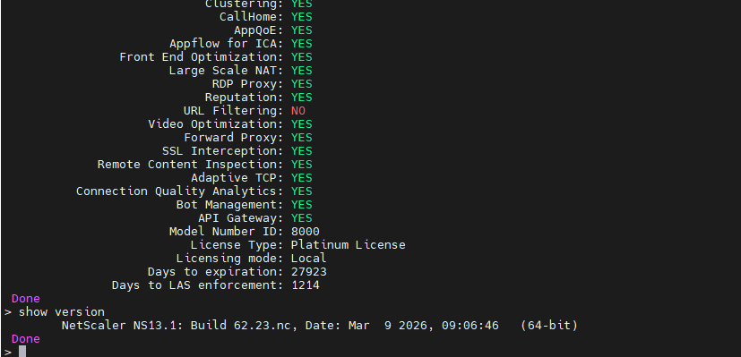
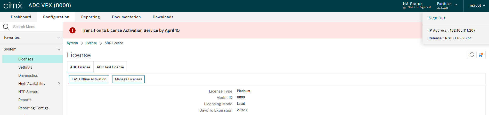
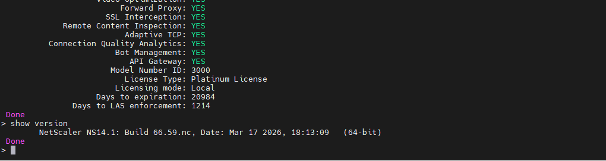
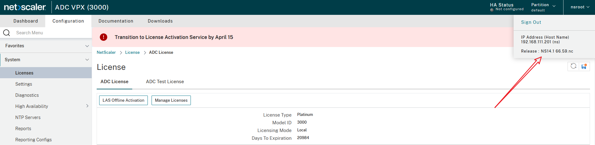
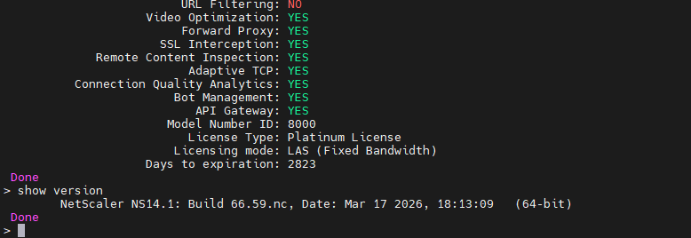
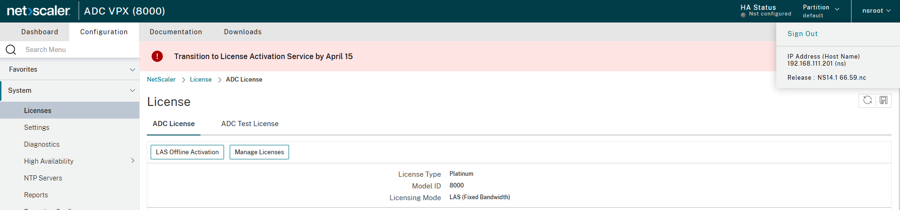
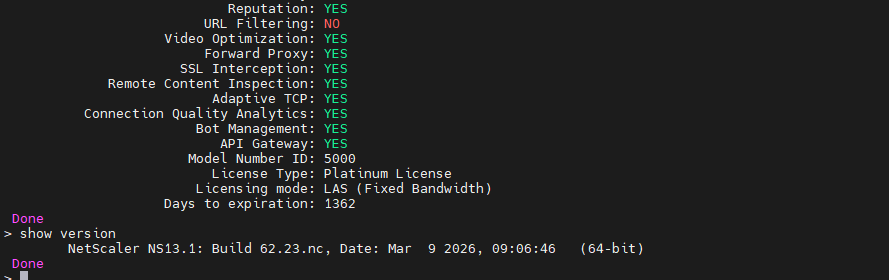
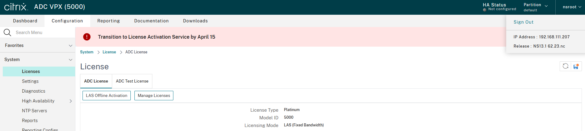

# Citrix 许可证激活服务 (LAS) 迁移技术指南

## 紧急通知：2026 年 4 月 15 日截止日期

2025 年 9 月 8 日，Citrix 正式宣布终止传统基于文件的许可证系统（File-Based Licensing），并要求所有客户在 **2026 年 4 月 15 日**前迁移至许可证激活服务（License Activation Service，简称 LAS）。届时，所有 `.lic` 文件将停止验证，仍依赖文件许可证的产品将丧失功能。

---

## 一、什么是 LAS

License Activation Service (LAS) 是 Citrix 推出的新一代云端许可证解决方案，用于替代传统的基于文件的许可证管理方式。

根据 Citrix 官方文档（CTX695107），LAS 的核心变化包括：

- **无需管理许可证激活码（License Activation Code）**：不再需要手动下载、上传或维护激活码
- **消除许可证文件生命周期管理**：不再需要管理 `.lic` 文件的分发、续期和替换
- **无需产品特定的许可证文件**：不同产品不再需要单独的许可证文件
- **降低逐服务器管理负担**：许可证管理集中在云端完成
- **License Server 不再位于会话路径中**：减少单点故障风险

LAS 通过 License Server 与 Citrix Cloud 之间的持续通信完成许可证激活和权利验证。License Server 每 12-24 小时与 LAS 通信一次，权利自动更新。

---

## 二、受影响的产品

根据 CTX695846 和 CTX695107，以下产品支持并需要迁移至 LAS：

| 产品 | 说明 |
|------|------|
| **Citrix License Server** | 所有许可证管理的核心组件，必须首先升级 |
| **Citrix Virtual Apps and Desktops (CVAD)** | 包括虚拟桌面和应用交付 |
| **Citrix Provisioning (PVS)** | 虚拟磁盘流交付服务 |
| **Workspace Environment Management (WEM)** | 用户环境管理 |
| **NetScaler ADC** | 应用交付控制器（负载均衡、WAF 等） |
| **NetScaler Console Service / on-premises** | NetScaler 集中管理平台 |
| **NetScaler SVM** | NetScaler 服务虚拟机 |
| **XenServer** | 虚拟化平台 |
| **XenMobile** | 移动设备管理 |
| **Unicon Scout** | 终端管理 |

**注意**：仅使用 Citrix Cloud 服务（Citrix DaaS）的客户不受此变更影响。

---

## 三、不迁移将产生的影响

### 3.1 直接影响

根据 Citrix 官方声明，2026 年 4 月 15 日之后：

- **产品停止识别许可证**：未迁移到 LAS 的产品将无法识别基于文件的许可证，导致功能丧失或完全服务中断
- **无回退机制**：4 月 15 日是硬性截止日期，届时基于文件的许可证将变为不受支持且不可用
- **没有宽限期**：这是平台级变更，不同于单个许可证到期的宽限期机制

### 3.2 按产品的具体影响

**Citrix Virtual Apps and Desktops (CVAD)**
- 虚拟桌面和发布应用无法启动新会话
- Delivery Controller 因无法签出许可证而拒绝用户请求
- 已有会话可能在一段时间后被终止

**NetScaler ADC**
- 许可证验证失败，高级功能将被禁用或降级
- 依赖 NetScaler 的应用交付、负载均衡服务受影响

**NetScaler Gateway**
- VPN 远程接入中断
- ICA Proxy 功能失效，远程桌面用户无法连接

**Provisioning Services (PVS)**
- 虚拟磁盘流交付停止，依赖 PVS 启动的虚拟机无法正常引导

**Workspace Environment Management (WEM)**
- 用户环境策略管理功能受限

### 3.3 业务层面影响

- **业务中断**：核心应用交付通道中断，影响日常办公和远程办公
- **安全风险**：NetScaler WAF、SSL VPN 等安全功能失效，可能导致合规问题
- **运维成本**：紧急迁移的人力和时间成本远高于计划迁移
- **供应商依赖性增加**：迁移后许可证管理从本地自治转变为依赖 Citrix Cloud 基础设施

---

## 四、版本兼容性要求

### 4.1 Citrix License Server

License Server 是所有 LAS 迁移的前提，必须升级至支持 LAS 的版本：

| License Server 版本 | 支持的产品 |
|---------------------|-----------|
| **11.17.2 Build 51000+** | CVAD 2411 |
| **11.17.2 Build 52100+** | CVAD 2503 |
| **11.17.2 Build 53100+** | CVAD、PVS、XenServer、WEM、Unicon Scout、XenMobile |

### 4.2 Citrix Virtual Apps and Desktops

根据 CTX695767（LAS FAQ）：

| 版本通道 | 支持 LAS 的版本 |
|---------|----------------|
| **LTSR** | 2203 CU7、2402 CU3、2507 |
| **Current Release** | 2411 |

**重要说明**：许可证在控制平面层面处理，不影响工作负载（VDA），因此 VDA 无需升级即可使用 LAS。

### 4.3 Citrix Provisioning (PVS)

| 版本 |
|------|
| 2203 LTSR CU7.1 |
| 2402 LTSR CU3.1 |
| 2507.1 LTSR |

### 4.4 Workspace Environment Management (WEM)

| 版本 |
|------|
| 2507 |

---

## 五、网络连接要求

LAS 要求 License Server 能够通过 **端口 443（HTTPS）** 出站访问以下 Citrix Cloud 端点。请在防火墙中配置相应的白名单规则。

### 商业版（美国区域）

| 端点地址 | 用途 |
|---------|------|
| `las.cloud.com` | LAS 主服务 |
| `customers.citrixworkspacesapi.net` | 客户 API |
| `trust.citrixnetworkapi.net` | 信任验证 |
| `trust.citrixworkspacesapi.net` | 工作区信任验证 |
| `cis.citrix.com` | Citrix 云服务 |
| `core.citrixworkspacesapi.net` | 核心工作区 API |

### 日本区域

使用 `.jp` 域名后缀的对应端点（如 `las.citrixcloud.jp`）

### 政府版

使用 `.us` 域名后缀的对应端点（如 `las.cloud.us`）

### 欧洲区域

使用 `api-eu.cloud.com` 及对应端点

**提示**：如果操作系统证书需要更新，还需开放 CRL/OCSP 证书验证端点的访问。

---

## 六、迁移步骤

### 6.1 第一步：升级 License Server

```powershell
# 1. 备份现有许可证文件
Copy-Item "C:\Program Files (x86)\Citrix\Licensing\MyFiles\*.lic" `
          "D:\Backup\CitrixLicense\" -Force

# 2. 备份 License Server 配置
Copy-Item "C:\Program Files (x86)\Citrix\Licensing\LS\conf\server.xml" `
          "D:\Backup\CitrixLicense\" -Force

# 3. 从 Citrix 下载页面获取最新版 License Server（11.17.2 Build 53100+）
# 4. 以管理员权限运行安装程序，选择"升级"模式
```

### 6.2 第二步：注册 License Server 到 Citrix Cloud

根据 Citrix 官方文档，注册流程如下：

1. 登录 Citrix Licensing Manager（`https://<license-server>:8083`）
2. 导航至 **Dashboard > License Activation Service** 选项卡
3. 点击 **Register**，系统生成一个 **8 位注册码**
4. 登录 Citrix Cloud（`https://myorg.cloud.com`）
5. 导航至 **Licensing > Licensed deployment > License Servers > Add**
6. 粘贴 8 位注册码并确认注册
7. 返回 License Server，验证权利（Entitlements）已同步（可能需要 12-24 小时）

**注意**：对于非美国区域（日本/政府/欧洲），需要修改 `SimpleLicenseServiceConfig.xml` 配置文件中的云端点地址。

### 6.3 第三步：在各产品中启用 LAS

**CVAD**：兼容的产品版本在指向已注册 LAS 的 License Server 后会自动激活。可通过 PowerShell 验证：
```powershell
Get-ConfigSite
# 检查 UseLicenseActivationService 属性
# True = LAS 已启用
# False = 仍使用文件许可证
```

**NetScaler ADC**：导航至 `System > Licenses > ADC License`，确认许可模式为 `LAS (Fixed Bandwidth)`

**NetScaler Console**：导航至 `NetScaler Licensing > License Management > License Activation Service (LAS)`

### 6.4 第四步：验证迁移结果

参照 CTX695846 的验证清单：

| 产品 | 验证方法 | 预期结果 |
|------|---------|---------|
| **License Server** | Citrix Licensing Manager Dashboard | LAS 状态显示注册成功，权利已同步 |
| **CVAD** | Citrix Studio > Licensing 节点，或 `Get-ConfigSite` | `UseLicenseActivationService = True` |
| **NetScaler ADC (GUI)** | System > Licenses > ADC License | 许可模式显示 `LAS (Fixed Bandwidth)` |
| **NetScaler ADC (CLI)** | `show ns license` | 许可模式显示 `LAS (Fixed Bandwidth)` |
| **NetScaler ADC (API)** | `https://<NSIP>/nitro/v1/config/nslicense` | 许可模式显示 `LAS` |
| **NetScaler SVM** | System > Licenses > LAS Offline Activation | LAS 激活状态为 `Active` |
| **NetScaler Console on-prem** | NetScaler Licensing > License Management > LAS | LAS 激活状态为 `Active`，实例列在 LAS 列表中 |
| **PVS** | PVS Console > Farm Properties > Licensing 选项卡 | 显示 `License Activation Service` |
| **XenServer** | XenCenter 2025.3+ > Tools > License Manager | 许可模式显示 `Cloud-based` |
| **XenMobile** | Settings > Licensing > Test Connection | 系统显示 `LAS is available` |
| **WEM** | 检查 Infrastructure Service Debug.log | 日志包含 `license valid: True` |

**WEM 日志路径**：`<WEM Infrastructure Service installation folder>\Logs`，查找日志条目：
```
Finish to check activation from Citrix Licensing Service (Web), license valid: True
```

### 6.5 NetScaler 迁移前后对比截图

以下展示 NetScaler 在不同版本、不同许可模式下的实际截图，帮助管理员直观确认迁移状态。

#### 迁移前：Local 模式（基于文件的许可证）

注意 CLI 输出中 `Licensing mode: Local` 以及 `Days to LAS enforcement` 倒计时字段，表示距离强制迁移的剩余天数。GUI 页面顶部显示红色警告横幅 **"Transition to License Activation Service by April 15"**。

**NetScaler 13.1 — Local 模式**

CLI 输出（`show ns license` / `show version`）：License Type: Platinum License，Licensing mode: Local，Days to LAS enforcement: 1214，版本 NS13.1 Build 62.23.nc



GUI 界面（System > Licenses > ADC License）：



**NetScaler 14.1 — Local 模式**

CLI 输出：License Type: Platinum License，Licensing mode: Local，Days to LAS enforcement: 1214，版本 NS14.1 Build 66.59.nc



GUI 界面：



---

#### 迁移后：LAS (Fixed Bandwidth) 模式

注意 CLI 输出中 `Licensing mode: LAS (Fixed Bandwidth)`，且不再显示 `Days to LAS enforcement` 字段，表示迁移已完成。

**NetScaler 14.1 — LAS 模式**

CLI 输出：License Type: Platinum License，Licensing mode: LAS (Fixed Bandwidth)，Days to expiration: 2823，版本 NS14.1 Build 66.59.nc



GUI 界面（Licensing Mode 显示为 LAS (Fixed Bandwidth)）：



**NetScaler 13.1 — LAS 模式**

CLI 输出：License Type: Platinum License，Licensing mode: LAS (Fixed Bandwidth)，Days to expiration: 1362，版本 NS13.1 Build 62.23.nc



GUI 界面（Licensing Mode 显示为 LAS (Fixed Bandwidth)，IP: 192.168.111.207）：



---

#### 迁移前后对比总结

| 对比项 | Local 模式（迁移前） | LAS 模式（迁移后） |
|--------|---------------------|-------------------|
| Licensing mode | Local | LAS (Fixed Bandwidth) |
| Days to LAS enforcement | 显示倒计时（如 1214 天） | 不显示（已完成迁移） |
| Days to expiration | 显示文件许可证到期天数 | 显示 LAS 许可证到期天数 |
| GUI 警告横幅 | 红色 "Transition to LAS by April 15" | 无警告 |
| LAS Offline Activation 按钮 | 不显示 | 显示 |
| License 来源 | 本地 .lic 文件 | Citrix Cloud LAS |

---

## 七、宽限期与容错机制

LAS 提供以下容错机制（仅适用于已完成 LAS 迁移的环境）：

| 场景 | 行为 | 宽限期 |
|------|------|--------|
| License Server 无法连接 Citrix Cloud | 已激活的产品继续运行，新激活被拒绝 | **30 天** |
| 产品无法连接 License Server | 产品进入缓存模式，使用当前激活数据 | **30 天** |
| 宽限期内硬件属性发生变化 | 所有激活立即失效 | 无 |

**重要**：此 30 天宽限期仅适用于已迁移到 LAS 后发生的网络中断，不适用于 4 月 15 日前未完成迁移的场景。

---

## 八、离线环境（Air-Gapped）处理

根据 Citrix 官方文档，对于无法连接互联网的环境，LAS 提供离线激活选项。但该方式需要联系 Citrix 销售代表或技术支持获取具体处理流程。

对于受监管行业（政府、国防、金融）的离线环境，建议：
- 尽早与 Citrix 技术支持沟通离线激活方案
- 评估遥测数据流是否符合合规框架要求
- 确认数据驻留需求

**注意**：根据 CTX695846，由于法规要求，LAS 目前尚不适用于所有客户。如果当前部署未配置 LAS 激活，部分客户可能需继续使用现有方法并与 Citrix 协调过渡方案。

---

## 九、回退方案

在 2026 年 4 月 15 日之前，已启用 LAS 的环境可以临时回退到基于文件的许可证：

```powershell
# CVAD 回退命令
Set-ConfigSite -UseLicenseActivationService $false
```

**4 月 15 日之后此回退将不再可用。**

---

## 十、迁移时间规划建议

| 阶段 | 建议时间 | 任务 |
|------|---------|------|
| 发现与审计 | 立即开始 | 盘点所有使用 Citrix 许可证的组件，确认当前版本，评估网络连通性 |
| 版本对齐 | 4 月 11 日前 | 升级 License Server 和各产品至 LAS 兼容版本 |
| 连接架构 | 4 月 11 日前 | 配置防火墙白名单，申请 Citrix Cloud 账号 |
| 分阶段切换 | 4 月 12-13 日 | 先在测试环境执行 LAS 注册和激活，再推广到生产环境 |
| 验证 | 4 月 14 日 | 按 CTX695846 清单逐项验证所有产品 LAS 状态 |
| 缓冲 | 4 月 15 日 | 预留应急处理时间 |

**当前日期为 4 月 10 日，距离截止日期仅剩 5 天，建议立即开展迁移工作。**

---

## 十一、总结

此次 Citrix 许可模式变更是一次平台级强制迁移，核心要点：

1. **硬性截止日期**：2026 年 4 月 15 日后，所有基于文件的许可证将停止工作，没有宽限期
2. **影响范围广**：涵盖 CVAD、NetScaler、PVS、WEM、XenServer、XenMobile 等全线产品
3. **迁移前提**：License Server 必须升级至 11.17.2 Build 53100+，各产品需升级至兼容版本
4. **核心步骤**：升级 License Server → 注册到 Citrix Cloud → 各产品启用 LAS → 按 CTX695846 验证
5. **网络要求**：License Server 需通过 443 端口出站访问 Citrix Cloud 端点

---

## 参考资料

| 文档编号 | 标题 | 链接 |
|---------|------|------|
| CTX695846 | 验证部署是否已迁移至 LAS | https://support.citrix.com/external/article/CTX695846 |
| CTX695107 | License Activation Service：入门指南 | https://support.citrix.com/external/article/CTX695107 |
| CTX695767 | LAS 常见问题解答（CVAD） | https://support.citrix.com/external/article/CTX695767 |
| 官方文档 | License Activation Service（License Server） | https://docs.citrix.com/en-us/licensing/current-release/license-activation-service.html |
| 官方文档 | License Activation Service（NetScaler） | https://docs.netscaler.com/en-us/citrix-adc/current-release/licensing/ns-license-activation-service.html |
